# Graph Command Design

**Status**: ✅ Implemented (v1.11.0)
**Date**: 2025-12-26
**Priority**: Released

## Overview

The `graph` command generates Entity-Relationship Diagrams (ERD) from SQL dumps, enabling visualization, cycle detection, and dependency analysis. It includes an `order` command to output SQL dumps with tables sorted in topological order (parent tables before children).

## Problem Statement

Users need to:

- **Understand complex schemas** — Visualize FK relationships between 100+ tables with full column details
- **Find circular dependencies** — Identify FK cycles that complicate migrations
- **Plan refactoring** — See impact of schema changes across related tables
- **Generate documentation** — Auto-generate schema diagrams for onboarding
- **Ensure safe imports** — Order tables so FK constraints don't fail during restore

Current workarounds require manual inspection or database introspection tools that need a running database.

## Implemented Features

### ERD Generation (Graph Command)

```bash
# Interactive HTML ERD (default) - dark/light mode, copy Mermaid button, panzoom
sql-splitter graph dump.sql -o schema.html

# Graphviz DOT format with ERD-style tables (columns, types, PK/FK markers)
sql-splitter graph dump.sql -o schema.dot

# Mermaid erDiagram syntax (paste into GitHub/GitLab/Notion)
sql-splitter graph dump.sql -o schema.mmd --format mermaid

# JSON with full schema details (tables, columns, relationships, stats)
sql-splitter graph dump.sql -o schema.json --format json
sql-splitter graph dump.sql --json

# Filter to specific tables
sql-splitter graph dump.sql --tables "user*,order*" --exclude "log*,audit*"

# Show only tables involved in circular dependencies
sql-splitter graph dump.sql --cycles-only

# Focus on specific table and its relationships
sql-splitter graph dump.sql --table orders --transitive  # All dependencies
sql-splitter graph dump.sql --table users --reverse      # All dependents

# Auto-render to PNG/SVG/PDF (requires Graphviz)
sql-splitter graph dump.sql -o schema.png --render
```

### Topological Ordering (Order Command)

```bash
# Output dump with FK-ordered tables
sql-splitter order dump.sql -o ordered.sql

# Check for cycles without rewriting
sql-splitter order dump.sql --check

# Show ordering without rewriting file
sql-splitter order dump.sql --dry-run

# Reverse order (for DROP operations)
sql-splitter order dump.sql --reverse -o drop_order.sql
```

## CLI Options

### Graph Command

| Flag             | Description                                            | Default     |
| ---------------- | ------------------------------------------------------ | ----------- |
| `-o, --output`   | Output file (html, dot, mmd, json, png, svg, pdf)      | stdout      |
| `--format`       | Output format: `html`, `dot`, `mermaid`, `json`        | auto-detect |
| `-d, --dialect`  | SQL dialect                                            | auto-detect |
| `--layout`       | Layout direction: `lr` (left-right), `tb` (top-bottom) | lr          |
| `-t, --tables`   | Include only tables matching glob patterns             | all         |
| `-e, --exclude`  | Exclude tables matching glob patterns                  | none        |
| `--table`        | Focus on a specific table                              | all         |
| `--transitive`   | Show all dependencies of focused table                 | false       |
| `--reverse`      | Show all tables that depend on focused table           | false       |
| `--max-depth`    | Limit traversal depth                                  | unlimited   |
| `--cycles-only`  | Only show tables in circular dependencies              | false       |
| `--render`       | Render DOT to PNG/SVG/PDF using Graphviz               | false       |
| `-p, --progress` | Show progress bar                                      | false       |
| `--json`         | Output as JSON                                         | false       |

### Order Command

| Flag            | Description                                       | Default     |
| --------------- | ------------------------------------------------- | ----------- |
| `-o, --output`  | Output SQL file                                   | stdout      |
| `-d, --dialect` | SQL dialect                                       | auto-detect |
| `--check`       | Check for cycles and report order (don't write)   | false       |
| `--dry-run`     | Show topological order without writing            | false       |
| `--reverse`     | Reverse order (children before parents, for DROP) | false       |

## Output Formats

### 1. Interactive HTML (Default)

Self-contained HTML file with:

- **ERD visualization** using Mermaid erDiagram
- **Dark/light mode toggle** with system preference detection
- **Copy Mermaid button** to copy diagram code
- **Panzoom** for large diagrams (scroll to zoom, drag to pan)
- **sql-splitter branding** with semicolon icon and Monda font
- **Statistics** showing table, column, and relationship counts

Features:

- No external dependencies after load (opens directly in browser)
- Handles large schemas (tested with 281 tables, 3104 columns)
- Increased `maxTextSize` limit (500KB) for large diagrams
- Responsive design

### 2. Graphviz DOT (ERD Style)

```dot
digraph ERD {
  graph [pad="0.5", nodesep="1", ranksep="1.5"];
  rankdir=LR;
  node [shape=none, margin=0];
  edge [arrowhead=crow, arrowtail=none, dir=both];

  users [label=<
    <TABLE BORDER="0" CELLBORDER="1" CELLSPACING="0" CELLPADDING="4">
      <TR><TD BGCOLOR="#4a5568" COLSPAN="3"><FONT COLOR="white"><B>users</B></FONT></TD></TR>
      <TR>
        <TD BGCOLOR="#e2e8f0"><FONT POINT-SIZE="10"><B>Column</B></FONT></TD>
        <TD BGCOLOR="#e2e8f0"><FONT POINT-SIZE="10"><B>Type</B></FONT></TD>
        <TD BGCOLOR="#e2e8f0"><FONT POINT-SIZE="10"><B>Key</B></FONT></TD>
      </TR>
      <TR><TD ALIGN="LEFT" PORT="id">id</TD><TD ALIGN="LEFT"><FONT COLOR="#666666">INT</FONT></TD><TD ALIGN="CENTER">🔑 PK</TD></TR>
      <TR><TD ALIGN="LEFT" PORT="email">email</TD><TD ALIGN="LEFT"><FONT COLOR="#666666">VARCHAR(255)</FONT></TD><TD ALIGN="CENTER"></TD></TR>
    </TABLE>
  >];

  orders:user_id -> users:id [label="user_id→id"];
}
```



### 3. Mermaid erDiagram


### 4. JSON

```json
{
  "tables": [
    {
      "name": "users",
      "columns": [
        {
          "name": "id",
          "type": "INT",
          "is_primary_key": true,
          "is_foreign_key": false,
          "is_nullable": false
        },
        {
          "name": "email",
          "type": "VARCHAR",
          "is_primary_key": false,
          "is_foreign_key": false,
          "is_nullable": true
        }
      ]
    }
  ],
  "relationships": [
    {
      "from_table": "orders",
      "from_column": "user_id",
      "to_table": "users",
      "to_column": "id",
      "cardinality": "ManyToOne"
    }
  ],
  "stats": {
    "table_count": 2,
    "column_count": 4,
    "relationship_count": 1
  }
}
```

## Implementation Architecture

### Core Components

```
src/
├── cmd/
│   ├── graph.rs           # CLI handler for graph command
│   └── order.rs           # CLI handler for order command
├── graph/
│   ├── mod.rs             # Public API
│   ├── view.rs            # GraphView with full column info
│   ├── analysis.rs        # Cycle detection (Tarjan's SCC)
│   └── format/
│       ├── mod.rs         # OutputFormat, Layout enums
│       ├── html.rs        # Interactive HTML with Mermaid
│       ├── dot.rs         # Graphviz DOT ERD writer
│       ├── mermaid.rs     # Mermaid erDiagram writer
│       └── json.rs        # JSON writer
```

### Key Types

```rust
pub struct GraphView {
    pub tables: AHashMap<String, TableInfo>,
    pub edges: Vec<EdgeInfo>,
}

pub struct TableInfo {
    pub name: String,
    pub columns: Vec<ColumnInfo>,
}

pub struct ColumnInfo {
    pub name: String,
    pub col_type: String,
    pub is_primary_key: bool,
    pub is_foreign_key: bool,
    pub is_nullable: bool,
    pub references_table: Option<String>,
    pub references_column: Option<String>,
}

pub struct EdgeInfo {
    pub from_table: String,
    pub from_column: String,
    pub to_table: String,
    pub to_column: String,
    pub cardinality: Cardinality,
}

pub enum Cardinality {
    ManyToOne,  // Default for FK relationships
    OneToOne,
    OneToMany,
    ManyToMany,
}
```

## Algorithms

### Cycle Detection (Tarjan's SCC Algorithm)

The implementation uses Tarjan's strongly connected components algorithm to detect:

- Self-referencing tables (e.g., categories with parent_id)
- Multi-table circular dependencies

### Topological Ordering

The order command uses Kahn's algorithm for topological sorting:

- Parents are output before children for safe FK imports
- Reverse mode outputs children before parents for DROP operations
- Detects and reports cycles that prevent valid ordering

## Performance

Tested with large schemas:

- **281 tables, 3104 columns**: Sub-second generation
- **All formats**: Consistent performance
- **Memory**: Proportional to schema size (not dump data size)

## Example Workflows

### 1. Quick Schema Visualization

```bash
sql-splitter graph dump.sql -o schema.html
# Opens interactive ERD in browser
```

### 2. Generate Documentation

```bash
# For GitHub/GitLab markdown
sql-splitter graph dump.sql -o docs/schema.mmd --format mermaid

# For technical docs with Graphviz
sql-splitter graph dump.sql -o docs/schema.dot
dot -Tpng docs/schema.dot -o docs/schema.png
```

### 3. Find Circular Dependencies

```bash
sql-splitter graph dump.sql --cycles-only
# Shows only tables involved in cycles
```

### 4. Plan Migration Impact

```bash
# What tables depend on 'users'?
sql-splitter graph dump.sql --table users --reverse -o users_dependents.html

# What does 'orders' depend on (transitively)?
sql-splitter graph dump.sql --table orders --transitive -o orders_deps.html
```

### 5. Safe Import Order

```bash
# Check if dump can be imported without FK errors
sql-splitter order dump.sql --check

# Rewrite for safe import
sql-splitter order dump.sql -o ordered.sql
```

## Testing

The implementation includes:

- Unit tests for each formatter (DOT, Mermaid, JSON, HTML)
- Unit tests for cycle detection (self-refs, multi-table cycles)
- Unit tests for GraphView filtering (include/exclude patterns)
- Integration tests across all dialects
- Real-world testing with 281-table production schemas

## Related Documents

- [Roadmap](../ROADMAP.md)
- [Sample Feature](../archived/SAMPLE_FEATURE.md) — Uses schema graph
- [Shard Feature](../archived/SHARD_FEATURE.md) — Uses schema graph
