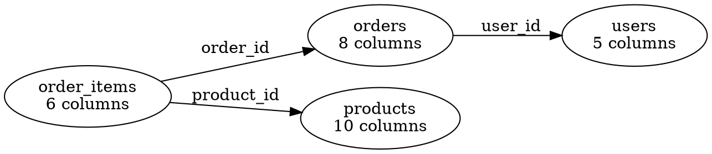
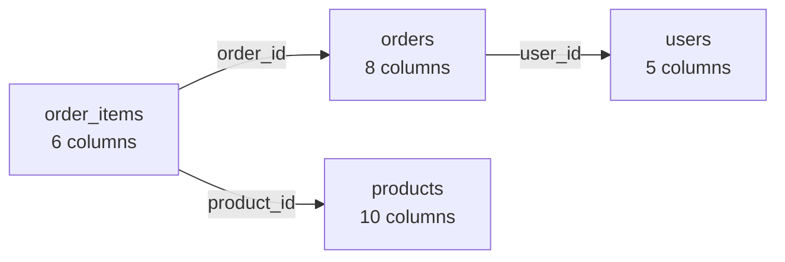

# Graph Command Design

**Status**: Planning (v1.11.0)
**Date**: 2025-12-24
**Priority**: High (next release)

## Overview

The `graph` command exports the foreign key dependency graph from SQL dumps, enabling visualization, cycle detection, and dependency analysis. It also includes an `order` command to output SQL dumps with tables sorted in topological order (parent tables before children).

## Problem Statement

Users need to:
- **Understand complex schemas** — Visualize FK relationships between 100+ tables
- **Find circular dependencies** — Identify FK cycles that complicate migrations
- **Plan refactoring** — See impact of schema changes across related tables
- **Generate documentation** — Auto-generate schema diagrams for onboarding
- **Ensure safe imports** — Order tables so FK constraints don't fail during restore

Current workarounds require manual inspection or database introspection tools that need a running database.

## Command Interface

### Simple Database Diagram Mode (Default)

The easiest way to visualize your database schema:

```bash
# Generate complete database diagram (auto-detects best format)
sql-splitter diagram dump.sql

# Opens Mermaid diagram in default browser
# Shows all tables with FK relationships

# Save to specific format
sql-splitter diagram dump.sql -o schema.png
sql-splitter diagram dump.sql -o schema.svg
sql-splitter diagram dump.sql -o schema.pdf

# Open diagram after generating
sql-splitter diagram dump.sql --open

# Exclude system/migration tables automatically
sql-splitter diagram dump.sql --clean
```

**Note:** `diagram` is an alias for `graph --simple`. It automatically:
- Excludes common system tables (migrations, schema_versions, etc.)
- Uses sensible layout defaults
- Renders to visual format (PNG/SVG) if possible
- Groups related tables visually

### Advanced Graph Export

For more control and analysis:

```bash
# Export as Graphviz DOT format
sql-splitter graph dump.sql -o schema.dot

# Export as Mermaid diagram (paste into GitHub/GitLab)
sql-splitter graph dump.sql -o schema.mmd --format mermaid

# Export as JSON for custom processing
sql-splitter graph dump.sql -o graph.json --format json

# Show only tables involved in circular dependencies
sql-splitter graph dump.sql --cycles-only

# Filter to specific tables and their relationships
sql-splitter graph dump.sql --tables "users,orders,products"

# Exclude system tables
sql-splitter graph dump.sql --exclude "migrations,schema_*"

# Show all tables that depend on 'users' (transitive)
sql-splitter graph dump.sql --table users --transitive

# Show what references 'users' (reverse dependencies)
sql-splitter graph dump.sql --table users --reverse
```

### Topological Ordering

```bash
# Output dump with FK-ordered tables
sql-splitter order dump.sql -o ordered.sql

# Verify current ordering
sql-splitter order dump.sql --check

# Show ordering without rewriting file
sql-splitter order dump.sql --dry-run
```

## CLI Options

### Diagram Command (Simple Mode)

| Flag | Description | Default |
|------|-------------|---------|
| `-o, --output` | Output file (.png, .svg, .pdf, .html) | schema.html |
| `--open` | Open diagram in browser after generation | false |
| `--clean` | Exclude common system tables | true |
| `--layout` | Layout algorithm: `lr`, `tb`, `radial` | lr |
| `--theme` | Color theme: `default`, `dark`, `minimal` | default |
| `-d, --dialect` | SQL dialect | auto-detect |

**Supported output formats:**
- `.html` — Interactive Mermaid diagram (default, opens in browser)
- `.png` — PNG image (requires Graphviz)
- `.svg` — SVG vector graphic (requires Graphviz)
- `.pdf` — PDF document (requires Graphviz)
- `.mmd` — Mermaid source (paste into GitHub/GitLab)
- `.dot` — Graphviz DOT source

### Graph Command (Advanced Mode)

| Flag | Description | Default |
|------|-------------|---------|
| `-o, --output` | Output file path | stdout |
| `-f, --format` | Output format: `dot`, `mermaid`, `json`, `html` | dot |
| `-d, --dialect` | SQL dialect | auto-detect |
| `--simple` | Use simplified output (same as `diagram`) | false |
| `--cycles-only` | Show only tables involved in cycles | false |
| `--table` | Focus on specific table | all |
| `--transitive` | Show transitive dependencies | false |
| `--tables` | Include only these tables | all |
| `--exclude` | Exclude tables (glob patterns) | none |
| `--reverse` | Show reverse dependencies (who references X) | false |
| `--max-depth` | Limit dependency depth | unlimited |
| `--layout` | Layout algorithm: `lr`, `tb`, `radial`, `dot` | lr |
| `--theme` | Color theme: `default`, `dark`, `minimal` | default |
| `--render` | Auto-render to PNG/SVG (requires Graphviz) | false |

### Order Command

| Flag | Description | Default |
|------|-------------|---------|
| `-o, --output` | Output file path | stdout |
| `-d, --dialect` | SQL dialect | auto-detect |
| `--check` | Verify ordering without output | false |
| `--dry-run` | Show order without rewriting | false |
| `--reverse` | Order children before parents | false |

## Output Formats

### 0. Interactive HTML (Default for `diagram` command)

Self-contained HTML file with embedded Mermaid diagram:

```html
<!DOCTYPE html>
<html>
<head>
  <title>Database Schema - dump.sql</title>
  <script src="https://cdn.jsdelivr.net/npm/mermaid/dist/mermaid.min.js"></script>
</head>
<body>
  <div class="mermaid">
    graph LR
      users[users<br/>5 columns]
      orders[orders<br/>8 columns]
      products[products<br/>10 columns]

      orders -->|user_id| users
      order_items -->|order_id| orders
      order_items -->|product_id| products
  </div>
</body>
</html>
```

**Features:**
- No external dependencies (opens directly in browser)
- Interactive: hover to highlight, click to focus
- Responsive layout
- Dark mode support
- Zoom and pan

**Usage:**
```bash
sql-splitter diagram dump.sql
# Opens schema.html in default browser automatically
```

### 1. Graphviz DOT



**Rendering:**
```bash
sql-splitter graph dump.sql -o schema.dot
dot -Tpng schema.dot -o schema.png
```

### 2. Mermaid



**Rendering:**
- Paste into GitHub/GitLab markdown
- Use Mermaid Live Editor
- Render with mermaid-cli

### 3. JSON

```json
{
  "tables": [
    {
      "name": "users",
      "column_count": 5,
      "references": [],
      "referenced_by": ["orders", "comments"]
    },
    {
      "name": "orders",
      "column_count": 8,
      "references": [
        {
          "table": "users",
          "foreign_key": "user_id",
          "referenced_column": "id"
        }
      ],
      "referenced_by": ["order_items"]
    }
  ],
  "cycles": [
    ["categories", "parent_category_id", "categories"]
  ],
  "topological_order": ["users", "products", "orders", "order_items"]
}
```

## Implementation Architecture

### Core Components

```
src/
├── cmd/
│   ├── diagram.rs         # CLI handler for diagram command (simple mode)
│   ├── graph.rs           # CLI handler for graph command (advanced)
│   └── order.rs           # CLI handler for order command
├── graph/
│   ├── mod.rs             # Public API
│   ├── builder.rs         # Build graph from schema
│   ├── cycles.rs          # Cycle detection (Tarjan's SCC)
│   ├── topo_sort.rs       # Topological sorting
│   ├── simplify.rs        # Auto-exclude system tables, group tables
│   ├── output/
│   │   ├── html.rs        # Interactive HTML with Mermaid
│   │   ├── dot.rs         # Graphviz DOT writer
│   │   ├── mermaid.rs     # Mermaid writer
│   │   ├── json.rs        # JSON writer
│   │   └── render.rs      # Auto-render to PNG/SVG (via Graphviz)
│   └── analysis.rs        # Dependency analysis
```

### Key Types

```rust
pub struct DependencyGraph {
    /// Map of table name to node
    nodes: HashMap<String, Node>,
    /// Adjacency list (table -> list of tables it references)
    edges: HashMap<String, Vec<Edge>>,
}

pub struct Node {
    pub name: String,
    pub column_count: usize,
    pub row_count: Option<u64>,
}

pub struct Edge {
    pub from_table: String,
    pub to_table: String,
    pub foreign_key: ForeignKey,
}

pub struct ForeignKey {
    pub name: Option<String>,
    pub columns: Vec<String>,
    pub referenced_table: String,
    pub referenced_columns: Vec<String>,
}

pub struct GraphConfig {
    pub input: PathBuf,
    pub output: Option<PathBuf>,
    pub format: GraphFormat,
    pub dialect: SqlDialect,
    pub cycles_only: bool,
    pub focus_table: Option<String>,
    pub transitive: bool,
    pub tables: Option<Vec<String>>,
    pub exclude: Vec<String>,
    pub reverse: bool,
    pub max_depth: Option<usize>,
}

pub enum GraphFormat {
    Dot,
    Mermaid,
    Json,
}

pub struct CycleDetector {
    graph: &DependencyGraph,
    visited: HashSet<String>,
    stack: Vec<String>,
}

pub struct TopoSort {
    graph: &DependencyGraph,
    visited: HashSet<String>,
    order: Vec<String>,
}
```

## Algorithms

### 1. Cycle Detection (Tarjan's Algorithm)

```rust
impl CycleDetector {
    pub fn find_cycles(&mut self) -> Vec<Vec<String>> {
        let mut cycles = Vec::new();

        for node in self.graph.nodes.keys() {
            if !self.visited.contains(node) {
                self.dfs(node, &mut cycles);
            }
        }

        cycles
    }

    fn dfs(&mut self, node: &str, cycles: &mut Vec<Vec<String>>) {
        self.visited.insert(node.to_string());
        self.stack.push(node.to_string());

        if let Some(edges) = self.graph.edges.get(node) {
            for edge in edges {
                let target = &edge.to_table;

                if self.stack.contains(target) {
                    // Found cycle
                    let cycle_start = self.stack.iter()
                        .position(|t| t == target)
                        .unwrap();
                    cycles.push(self.stack[cycle_start..].to_vec());
                } else if !self.visited.contains(target) {
                    self.dfs(target, cycles);
                }
            }
        }

        self.stack.pop();
    }
}
```

### 2. Topological Sort (Kahn's Algorithm)

```rust
impl TopoSort {
    pub fn sort(&mut self) -> Result<Vec<String>, Vec<String>> {
        let mut in_degree = self.compute_in_degree();
        let mut queue: VecDeque<String> = in_degree.iter()
            .filter(|(_, &deg)| deg == 0)
            .map(|(name, _)| name.clone())
            .collect();

        let mut order = Vec::new();

        while let Some(node) = queue.pop_front() {
            order.push(node.clone());

            if let Some(edges) = self.graph.edges.get(&node) {
                for edge in edges {
                    let target = &edge.to_table;
                    *in_degree.get_mut(target).unwrap() -= 1;

                    if in_degree[target] == 0 {
                        queue.push_back(target.clone());
                    }
                }
            }
        }

        if order.len() == self.graph.nodes.len() {
            Ok(order)
        } else {
            // Cycle exists
            let remaining: Vec<_> = self.graph.nodes.keys()
                .filter(|n| !order.contains(n))
                .cloned()
                .collect();
            Err(remaining)
        }
    }

    fn compute_in_degree(&self) -> HashMap<String, usize> {
        let mut in_degree = HashMap::new();

        for node in self.graph.nodes.keys() {
            in_degree.insert(node.clone(), 0);
        }

        for edges in self.graph.edges.values() {
            for edge in edges {
                *in_degree.get_mut(&edge.to_table).unwrap() += 1;
            }
        }

        in_degree
    }
}
```

## Edge Cases

### 1. Self-Referencing Tables

```sql
CREATE TABLE categories (
  id INT PRIMARY KEY,
  parent_id INT,
  FOREIGN KEY (parent_id) REFERENCES categories(id)
);
```

**Handling:**
- Show as self-loop in graph
- Mark as cycle in cycle detection
- Place anywhere in topological order (optional constraint)

### 2. Composite Foreign Keys

```sql
FOREIGN KEY (tenant_id, user_id) REFERENCES users(tenant_id, id)
```

**Handling:**
- Edge label shows all columns: `tenant_id, user_id`
- JSON includes full column list

### 3. Multiple FKs Between Same Tables

```sql
CREATE TABLE orders (
  user_id INT,
  assigned_user_id INT,
  FOREIGN KEY (user_id) REFERENCES users(id),
  FOREIGN KEY (assigned_user_id) REFERENCES users(id)
);
```

**Handling:**
- Show multiple edges with different labels
- Count as single dependency for topological sort

### 4. Missing FK Declarations

Many schemas have implicit relationships without FK constraints.

**Handling:**
- Only show declared FKs (don't infer)
- Future: `--infer-fks` flag for heuristic detection

## Performance Considerations

### Target Performance

| Dump Size | Tables | Time |
|-----------|--------|------|
| 10 MB | 50 | < 1s |
| 100 MB | 200 | < 3s |
| 1 GB | 500 | < 10s |

**Key optimizations:**
- Schema-only parsing (skip INSERT statements)
- HashMap-based graph construction
- Tarjan's algorithm is O(V+E)
- Kahn's algorithm is O(V+E)

## Example Workflows

### 1. Quick Database Visualization (Simplest)

```bash
# Generate and open interactive diagram immediately
sql-splitter diagram dump.sql

# That's it! Browser opens with your schema diagram.
```

### 2. Generate Documentation

```bash
# Simple mode - automatic cleanup and formatting
sql-splitter diagram prod.sql -o docs/schema.png

# Advanced mode - full control
sql-splitter graph prod.sql -o docs/schema.dot
dot -Tpng docs/schema.dot -o docs/schema.png

# Or for GitHub/GitLab markdown
sql-splitter diagram prod.sql -o docs/schema.mmd
```

### 3. Find Problematic Cycles

```bash
sql-splitter graph dump.sql --cycles-only
# Output:
# Cycles detected:
#   1. categories -> categories (parent_id)
#   2. users -> groups -> users (admin_id, owner_id)
```

### 4. Plan Migration

```bash
# What tables depend on 'users'?
sql-splitter graph dump.sql --table users --reverse

# What does 'orders' depend on (transitively)?
sql-splitter graph dump.sql --table orders --transitive
```

### 5. Safe Import Order

```bash
sql-splitter order messy.sql -o clean.sql

# Verify before using
sql-splitter order clean.sql --check
# ✓ Tables are correctly ordered (topological)
```

## Testing Strategy

### Unit Tests
- Graph construction from FK declarations
- Cycle detection (self-loops, multi-table cycles)
- Topological sort (DAG, with cycles)
- Each output format (DOT, Mermaid, JSON)

### Integration Tests
- Real-world schema (Shopify, WordPress, etc.)
- All three dialects
- Large schemas (500+ tables)
- Edge cases (composite FKs, self-references)

### Golden File Tests
- Render DOT and compare to expected output
- JSON schema validation

## Estimated Effort

| Component | Effort |
|-----------|--------|
| Graph builder (reuse schema graph) | 1 hour |
| Cycle detection (Tarjan's) | 2 hours |
| Topological sort (Kahn's) | 2 hours |
| DOT output writer | 1 hour |
| Mermaid output writer | 1 hour |
| HTML output writer (interactive) | 2 hours |
| JSON output writer | 30 min |
| Table simplification/cleanup | 1 hour |
| Diagram command (simple mode) | 2 hours |
| Auto-render to PNG/SVG | 1.5 hours |
| Order command | 1 hour |
| CLI integration | 1 hour |
| Testing | 4 hours |
| Documentation | 1 hour |
| **Total** | **~12 hours** |

**Note:** Effort increased from initial estimate due to:
- Interactive HTML output with Mermaid
- Simplified `diagram` command for better UX
- Auto-rendering capabilities

## Future Enhancements

1. **FK Inference** — Detect implicit relationships via naming patterns
2. **Interactive Exploration** — Web UI for navigating large graphs
3. **Diff Graphs** — Show schema changes between versions
4. **Metrics** — Table coupling analysis (how connected is each table)
5. **Subgraph Extraction** — Extract table + all dependencies
6. **Graphviz Styling** — Color-code by table type, size, etc.

## Related Documents

- [Roadmap](../ROADMAP.md)
- [Sample Feature](../archived/SAMPLE_FEATURE.md) — Uses schema graph
- [Shard Feature](../archived/SHARD_FEATURE.md) — Uses schema graph
