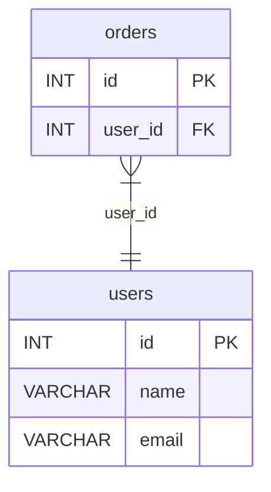

Generate Entity-Relationship Diagrams (ERD) in multiple formats.

**Alias:** `gr` (e.g., `sql-splitter gr dump.sql -o schema.html`)

## Usage

```bash
sql-splitter graph <INPUT> [OPTIONS]
```

## Examples

```bash
# Interactive HTML (default)
sql-splitter graph dump.sql -o schema.html

# Graphviz DOT format
sql-splitter graph dump.sql -o schema.dot

# Mermaid erDiagram
sql-splitter graph dump.sql -o schema.mmd --format mermaid

# JSON with full schema details
sql-splitter graph dump.sql --json

# Filter to specific tables
sql-splitter graph dump.sql --tables "user*,order*" --exclude "log*"

# Show only circular dependencies
sql-splitter graph dump.sql --cycles-only

# Focus on one table's dependencies
sql-splitter graph dump.sql --table orders --transitive

# Show tables that depend on users
sql-splitter graph dump.sql --table users --reverse
```

## Options

| Flag | Short | Description | Default |
|------|-------|-------------|---------|
| `--output` | `-o` | Output file (html, dot, mmd, json, png, svg, pdf) | stdout |
| `--format` | | Output format: `html`, `dot`, `mermaid`, `json` | auto |
| `--dialect` | `-d` | SQL dialect | auto-detect |
| `--layout` | | Layout direction: `lr` (horizontal), `tb` (vertical) | `lr` |
| `--tables` | `-t` | Include tables matching glob patterns | all |
| `--exclude` | `-e` | Exclude tables matching glob patterns | none |
| `--table` | | Focus on a specific table | - |
| `--transitive` | | Show all dependencies of focused table | false |
| `--reverse` | | Show all tables that depend on focused table | false |
| `--max-depth` | | Limit traversal depth | unlimited |
| `--cycles-only` | | Only show tables in circular dependencies | false |
| `--render` | | Render DOT to PNG/SVG/PDF using Graphviz | false |
| `--progress` | `-p` | Show progress bar | false |
| `--json` | | Output as JSON | false |

## Output Formats

### HTML (default)

Interactive diagram with:
- Dark/light theme toggle
- Pan and zoom
- Click to highlight relationships
- Copy Mermaid button

### Graphviz DOT

```text title="schema.dot"
digraph schema {
  rankdir=LR;
  users [label="users|id INT PK\lname VARCHAR\lemail VARCHAR\l"];
  orders [label="orders|id INT PK\luser_id INT FK\l"];
  orders -> users [label="user_id"];
}
```

Render with Graphviz:
```bash
sql-splitter graph dump.sql -o schema.dot
dot -Tpng schema.dot -o schema.png
```

Or use `--render`:
```bash
sql-splitter graph dump.sql -o schema.png --render
```

### Mermaid



### JSON

Full schema details:
```json
{
  "tables": [
    {
      "name": "users",
      "columns": [...],
      "primary_key": ["id"],
      "foreign_keys": []
    }
  ],
  "relationships": [...],
  "cycles": []
}
```

## Focusing on Tables

### Show dependencies

```bash
sql-splitter graph dump.sql --table orders --transitive
```

Shows `orders` and all tables it references (directly or indirectly).

### Show dependents

```bash
sql-splitter graph dump.sql --table users --reverse
```

Shows `users` and all tables that reference it.

## See Also

- [`order`](/commands/order) - Reorder dump for safe imports
- [`analyze`](/commands/analyze) - View table statistics
- [JSON Output Schema](/reference/json-schemas/) - Schema for `--json` output
