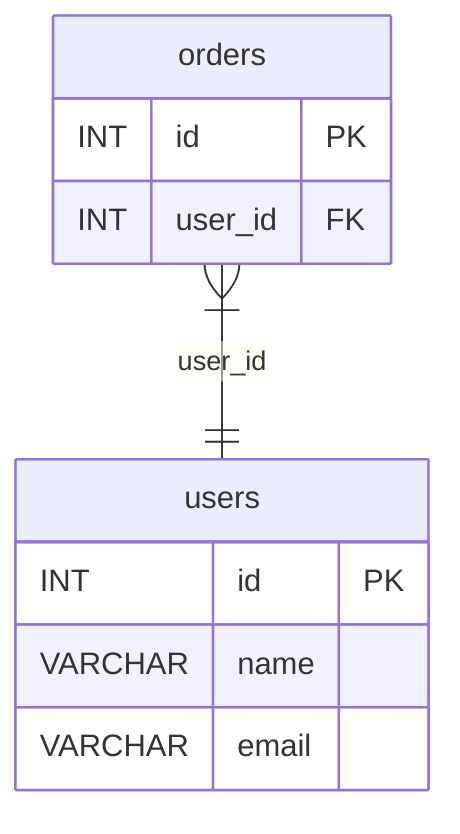

Generate Entity-Relationship Diagrams (ERD) in multiple formats.

**Alias:** `gr` (e.g., `sql-splitter gr dump.sql -o schema.html`)

## When to Use This

- **Schema documentation** - Generate visual diagrams for documentation or onboarding
- **Dependency analysis** - Understand which tables depend on which before refactoring
- **Safe DROP planning** - See what depends on a table before dropping it
- **Circular dependency detection** - Find problematic FK cycles that complicate migrations
- **Impact assessment** - Before modifying a table, see all tables that reference it

Use [`order`](/commands/order) if you need to reorder a dump for safe imports based on the dependency graph.

## How It Works

The graph command parses CREATE TABLE statements and foreign key definitions to build a dependency graph:

- **Nodes** = Tables (with columns, types, and constraints)
- **Edges** = Foreign key relationships (A → B means "A references B")

The direction matters: if `orders.user_id` references `users.id`, the edge goes `orders → users`. This means you must create `users` before `orders`.

## Usage

```bash
sql-splitter graph <INPUT> [OPTIONS]
```

## Examples

### Basic Diagram Generation

```bash
# Interactive HTML with pan/zoom (great for exploration)
sql-splitter graph dump.sql -o schema.html

# Mermaid format (embeds in Markdown docs)
sql-splitter graph dump.sql -o schema.mmd --format mermaid

# Graphviz DOT (for custom rendering)
sql-splitter graph dump.sql -o schema.dot
```

### Focusing on Specific Tables

For large schemas, focus on what matters:

```bash
# Show only user-related and order-related tables
sql-splitter graph dump.sql --tables "user*,order*" --exclude "log*"

# Focus on one table and its dependencies (what it references)
sql-splitter graph dump.sql --table orders --transitive

# Focus on one table and its dependents (what references it)
sql-splitter graph dump.sql --table users --reverse
```

### Finding Circular Dependencies

Circular FKs complicate imports and migrations. Find them:

```bash
# Show only tables involved in cycles
sql-splitter graph dump.sql --cycles-only
```

### Machine-Readable Output

```bash
# Full schema as JSON for tooling
sql-splitter graph dump.sql --json

# Pipe to jq for analysis
sql-splitter graph dump.sql --json | jq '.relationships | length'
```

## Options

| Flag            | Short | Description                                          | Default     |
| --------------- | ----- | ---------------------------------------------------- | ----------- |
| `--output`      | `-o`  | Output file (html, dot, mmd, json, png, svg, pdf)    | stdout      |
| `--format`      |       | Output format: `html`, `dot`, `mermaid`, `json`      | auto        |
| `--dialect`     | `-d`  | SQL dialect                                          | auto-detect |
| `--layout`      |       | Layout direction: `lr` (horizontal), `tb` (vertical) | `lr`        |
| `--tables`      | `-t`  | Include tables matching glob patterns                | all         |
| `--exclude`     | `-e`  | Exclude tables matching glob patterns                | none        |
| `--table`       |       | Focus on a specific table                            | -           |
| `--transitive`  |       | Show all dependencies of focused table               | false       |
| `--reverse`     |       | Show all tables that depend on focused table         | false       |
| `--max-depth`   |       | Limit traversal depth                                | unlimited   |
| `--cycles-only` |       | Only show tables in circular dependencies            | false       |
| `--render`      |       | Render DOT to PNG/SVG/PDF using Graphviz             | false       |
| `--progress`    | `-p`  | Show progress bar                                    | false       |
| `--json`        |       | Output as JSON                                       | false       |

## Output Formats

### HTML (default)

Interactive diagram with:

- Dark/light theme toggle
- Pan and zoom
- Click to highlight relationships
- Copy Mermaid button

### Graphviz DOT

```text title="schema.dot"
digraph schema {
  rankdir=LR;
  users [label="users|id INT PK\lname VARCHAR\lemail VARCHAR\l"];
  orders [label="orders|id INT PK\luser_id INT FK\l"];
  orders -> users [label="user_id"];
}
```

Render with Graphviz:

```bash
sql-splitter graph dump.sql -o schema.dot
dot -Tpng schema.dot -o schema.png
```

Or use `--render`:

```bash
sql-splitter graph dump.sql -o schema.png --render
```

### Mermaid



### JSON

Full schema details:

```json
{
  "tables": [
    {
      "name": "users",
      "columns": [...],
      "primary_key": ["id"],
      "foreign_keys": []
    }
  ],
  "relationships": [...],
  "cycles": []
}
```

## Focusing on Tables

### Show dependencies

```bash
sql-splitter graph dump.sql --table orders --transitive
```

Shows `orders` and all tables it references (directly or indirectly).

### Show dependents

```bash
sql-splitter graph dump.sql --table users --reverse
```

Shows `users` and all tables that reference it.

## Troubleshooting

### Graph is too large to read

Large schemas produce cluttered diagrams. Focus your view:

```bash
# Limit to specific tables
sql-splitter graph dump.sql --tables "core_*" --exclude "*_log,*_audit"

# Focus on a single table's neighborhood
sql-splitter graph dump.sql --table orders --transitive --max-depth 2

# Use JSON and filter programmatically
sql-splitter graph dump.sql --json | jq '.tables | map(select(.foreign_keys | length > 0))'
```

### Missing edges (FK relationships not shown)

Foreign keys must be explicitly defined in CREATE TABLE statements. Implicit FKs (application-level only) won't appear.

Check if FKs are defined:
```bash
sql-splitter graph dump.sql --json | jq '.relationships'
```

### Graphviz rendering fails

Install Graphviz, then render manually or use `--render`:

```bash
# Install Graphviz
brew install graphviz  # macOS
apt install graphviz   # Ubuntu/Debian

# Render DOT to PNG
sql-splitter graph dump.sql -o schema.dot
dot -Tpng schema.dot -o schema.png

# Or use --render (requires Graphviz installed)
sql-splitter graph dump.sql -o schema.png --render
```

### Wrong edge direction

Remember: edges point from the **referencing** table to the **referenced** table. If `orders.user_id → users.id`, the edge goes `orders → users` (orders depends on users).

## See Also

- [`order`](/commands/order) - Reorder dump for safe imports
- [`analyze`](/commands/analyze) - View table statistics
- [`validate`](/commands/validate) - Check FK integrity
- [JSON Output Schema](/reference/json-output/) - Schema for `--json` output
