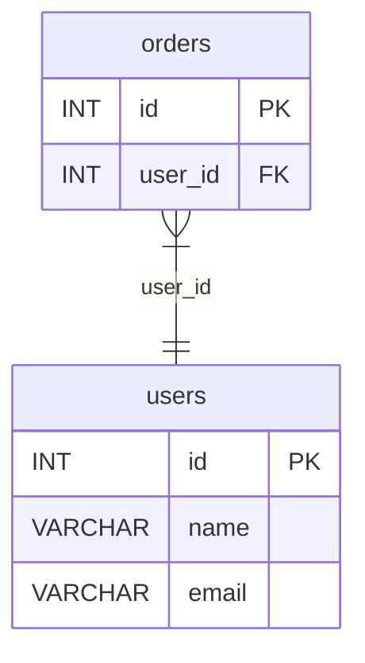

Visualize database schemas as Entity-Relationship Diagrams.

## Quick Start

```bash
# Interactive HTML diagram
sql-splitter graph dump.sql -o schema.html
```

Open `schema.html` in a browser for an interactive diagram with:
- Dark/light theme toggle
- Pan and zoom
- Click to highlight relationships

## Output Formats

### HTML (Interactive)

```bash
sql-splitter graph dump.sql -o schema.html
```

Best for exploration and presentations.

### Mermaid (Markdown)

```bash
sql-splitter graph dump.sql -o schema.mmd --format mermaid
```

Embed in Markdown documentation:

````markdown

````

### Graphviz DOT

```bash
sql-splitter graph dump.sql -o schema.dot
```

Render with Graphviz:

```bash
dot -Tpng schema.dot -o schema.png
dot -Tsvg schema.dot -o schema.svg
dot -Tpdf schema.dot -o schema.pdf
```

Or use `--render`:

```bash
sql-splitter graph dump.sql -o schema.png --render
```

### JSON (Data)

```bash
sql-splitter graph dump.sql --json -o schema.json
```

For programmatic processing.

## Filtering Tables

### Include specific tables

```bash
sql-splitter graph dump.sql --tables "user*,order*" -o filtered.html
```

### Exclude tables

```bash
sql-splitter graph dump.sql --exclude "log*,audit*,temp*" -o clean.html
```

## Focus Mode

### Show dependencies

Show a table and everything it depends on:

```bash
sql-splitter graph dump.sql --table orders --transitive -o orders-deps.html
```

### Show dependents

Show a table and everything that depends on it:

```bash
sql-splitter graph dump.sql --table users --reverse -o users-deps.html
```

### Limit depth

```bash
sql-splitter graph dump.sql --table orders --transitive --max-depth 2
```

## Detecting Cycles

Find circular foreign key dependencies:

```bash
sql-splitter graph dump.sql --cycles-only
```

Output:
```
Circular dependencies found:
  orders → payments → invoices → orders
```

Visualize cycles:

```bash
sql-splitter graph dump.sql --cycles-only -o cycles.html
```

## Layout Options

```bash
# Horizontal (left-to-right)
sql-splitter graph dump.sql --layout lr -o horizontal.html

# Vertical (top-to-bottom)
sql-splitter graph dump.sql --layout tb -o vertical.html
```

## Documentation Integration

### GitHub README

```bash
sql-splitter graph dump.sql -o schema.mmd --format mermaid
```

Include in README.md:

````markdown
## Database Schema

```mermaid
%%{init: {'theme': 'dark'}}%%
erDiagram
    ...
```
````

### Notion/Confluence

1. Generate Mermaid output
2. Paste into Mermaid code block

### Static Site

1. Generate HTML
2. Embed in an iframe or link directly
